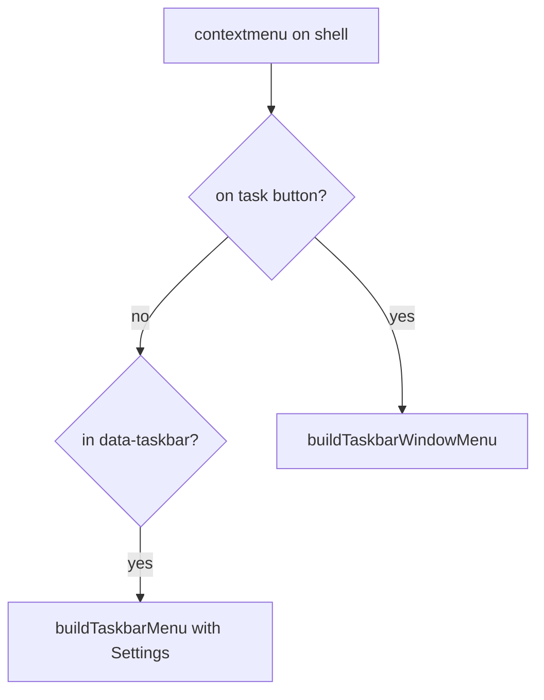

# Design — Taskbar context menu

> Status: Implemented
> Pairs with: `./requirements.md`
> Created: 2026-05-19

## Current codebase findings

- `ShellContextMenu.tsx` intercepts `contextmenu` on `[data-taskbar]` and calls `buildTaskbarMenu()` (placeholder only).
- `buildWindowTitleMenu()` in `contextMenuBuilders.ts` is the reference for window verbs via `os.win`.
- `Taskbar.tsx` task buttons lack `data-*` for hit-testing; left-click uses `wm.restoreWindow` / `wm.focusWindow`.
- Settings app id is `settings` in `registry.tsx`; launch via `os.win.openApp('settings')`.
- `FOCUS_WINDOW` in `sessionReducer.ts` is a no-op when `geometry.mode === 'minimized'` — taskbar **Focus** must call `restore` first when minimized.

## Proposed solution

Extend the global context-menu handler (no new React menu component). Split taskbar hits:

1. If target is a task button (`button[data-taskbar-window-id]`) → `buildTaskbarWindowMenu` with `os.win` handlers.
2. Else if inside `[data-taskbar]` → `buildTaskbarMenu` with Settings + disabled Tile Windows.

## Files / components affected

| Path | Change kind | Notes |
|------|-------------|-------|
| `src/utils/shellContextMenu.ts` | modify | `isTaskbarWindowButton` |
| `src/components/shell/Taskbar/Taskbar.tsx` | modify | `data-taskbar-window-id` on `TaskBtn` |
| `src/utils/contextMenuBuilders.ts` | modify | `buildTaskbarMenu`, `buildTaskbarWindowMenu` |
| `src/components/shell/ShellContextMenu/ShellContextMenu.tsx` | modify | Branch + `os.win` handlers |
| `docs/ROADMAP.md` | modify | P1.5 step |
| `docs/specs/2026-05-19-taskbar-context-menu/*` | add | Spec trio |

## Data model changes

None.

## API changes

None — reuses `useOs()` / `os.win` verbs only.

## UI / UX behavior

| Menu | Item | Action | Disabled when |
|------|------|--------|---------------|
| Taskbar chrome | Settings | `openApp('settings')` | never |
| Taskbar chrome | Tile Windows | — | always |
| Task button | Focus | `restore` if minimized, else `focus` | never |
| Task button | Maximize | `maximize(id, frame)` | minimized or maximized |
| Task button | Minimize | `minimize(id)` | minimized |
| Task button | Close | `requestClose` + `close` | never |

Settings appears on any taskbar chrome that is not a task button (Start, empty strip, tray).

## Security / privacy considerations

None.

## Testing strategy

Manual:

- Right-click empty taskbar / Start / tray → Settings opens.
- Right-click task button → Focus / Maximize / Minimize / Close for normal, minimized, maximized states.
- Left-click task button unchanged.

Automated:

- `npm run lint`
- `npm run build`

## Risks / tradeoffs

- No reducer changes — low regression risk.
- Title-bar close uses `requestClose` async guard; taskbar **Close** matches that pattern.
